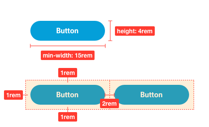

# Buttons
---

### Basic

| Class     | Example               |
|:-------------|:------------------|
| `button--primary`|      |
| `button--secondary`|  |
| `button--cta`|              |
| `button--negative`|    |
| `button--ghost` |  |

---

#### Sizes

| Class            | Size | Example                                        |                              
|:-----------------|:------|:-----------------------------------------------|
| `button--small`  | no minimum |  |
| `button--medium` | h: 4rem ; w:15rem |  |
| `button--large`  | h: 4rem ; w: over 30rem |  |

---

### Specifications

